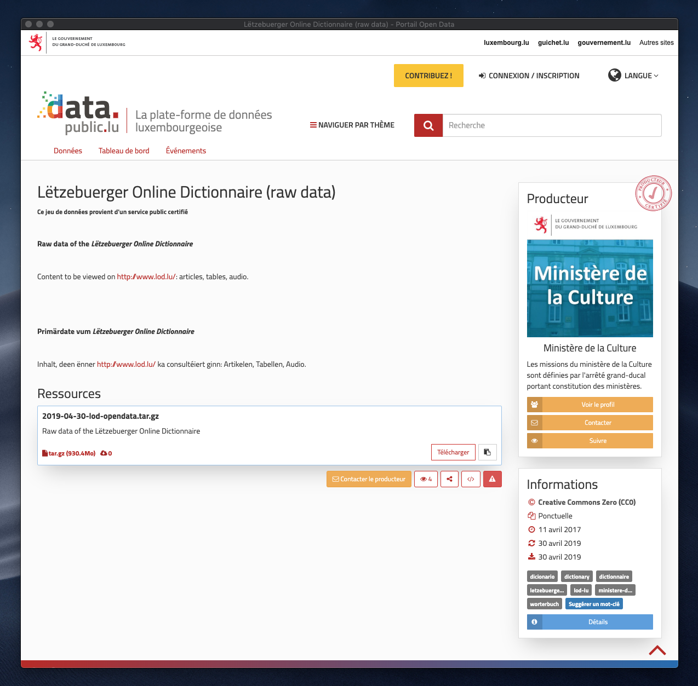

# Lod-audio

A NPM package for extract audio data of the Lëtzebuerger Online Dictionnaire (LOD).

Author: [Roberto Entringer](https://robertoentringer.com)  
License: MIT  
Npm package: https://www.npmjs.com/package/lod-audio  
Github: https://github.com/robertoentringer/lod-audio#readme

## Installation

```shell
$ npm install lod-audio
```

## Usage

Call script from the **package.json**:

```json
"scripts": {
  "extract": "lod-audio"
}
```

Call script from the **terminal**:

```shell
$ npx lod-audio
```

## Data source

Data from the "Lëtzebuerger Online Dictionnaire" (LOD)  
Website: http://www.lod.lu  
Source: https://data.public.lu/fr/datasets/letzebuerger-online-dictionnaire-raw-data/  
Licence: Creative Commons Zero (CC0)

[](https://data.public.lu/fr/datasets/letzebuerger-online-dictionnaire-raw-data/)

## MP3 audio files
The extracted mp3 audio files can be found in here: https://github.com/robertoentringer/lod-mp3-mirror
